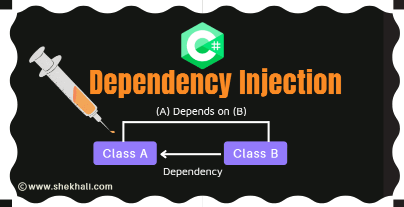
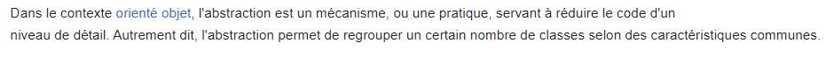
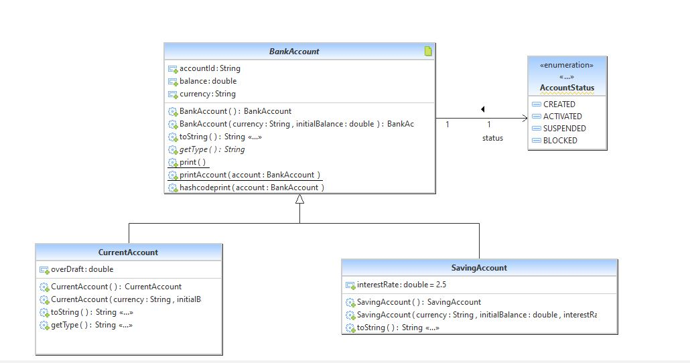
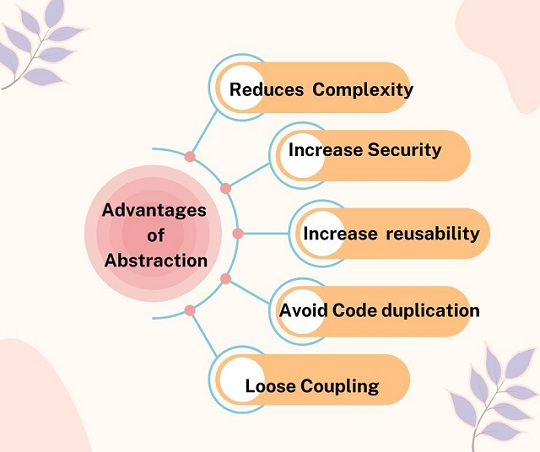
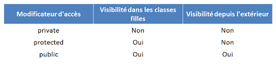

<h1>Les concepts fondamentaux de la programmation orient�e objet</h1>

La programmation orient�e objet repose sur 5 concepts fondamentaux � savoir :

<ul>
  <li>La classe</li>
  <li>L�objet</li>
  <li>L�encapsulation</li>
  <li>L�h�ritage</li>
  <li>Le polymorphisme
</li>
<li>Les classes Abstraite</li>
  <li>Le interface</li>

</ul>

<h2>L'abstraction </h2>

 

 
 
 

<h2> L�encapsulation</h2>
L'encapsulation est un mécanisme consistant � rassembler les donn�es et les m�thodes au sein d'une structure en cachant l'impl�mentation de l'objet, c'est-�-dire en emp�chant l'acc�s aux donn�es par un autre moyen que les services propos� 
c'est l'un des principes cl�s qui aident � concevoir un code bien structur� et facilement maintenable. Il fait r�f�rence � la pratique de regrouper les donn�es (attributs ou variables) et les m�thodes (fonctions) qui op�rent sur ces donn�es en une seule unit�, appel�e une classe. Cette classe contr�le ensuite l'acc�s � ses propres donn�es, restreignant la manipulation directe depuis l'ext�rieur de la classe.

Les propri�t�s des objets ne peuvent �tre acc�d�es que par ses m�thodes. Ainsi, la classe encapsule � la fois les attributs et les m�thodes qui permettent de manipuler les objets ind�pendamment de leurs �tats.

<strong> Modificateurs de visibilit�
</strong>En Java, l'encapsulation est r�alis�e gr�ce � l'utilisation des modificateurs d'acc�s et des m�thodes d'acc�s (getters) et de modification (setters). Voici comment fonctionne l'encapsulation en Java : 
 
  
<strong>Variables finales</strong> :  final est utilis� pour cr�er des �l�ments immuables et non extensibles, ce qui peut am�liorer la stabilit� et la s�curit� de votre code Java. - La valeur ne peut pas �tre modifi�e une fois qu'elle a �t� initialis�e - Ne peut pas �tre red�finie (surcharg�e)  - Ne peut pas �tre �tendue par d'autres classes  

<strong> 
Le Modificateur Static
</strong>

On appelle �l�ment statique d'une classe tout �l�ment attach� � cette classe plut�t qu'� l'une de ses instances. Un �l�ment statique peut exister, �tre r�f�renc�, ou s'ex�cuter m�me si aucune instance de cette classe n'existe. 

.
 

